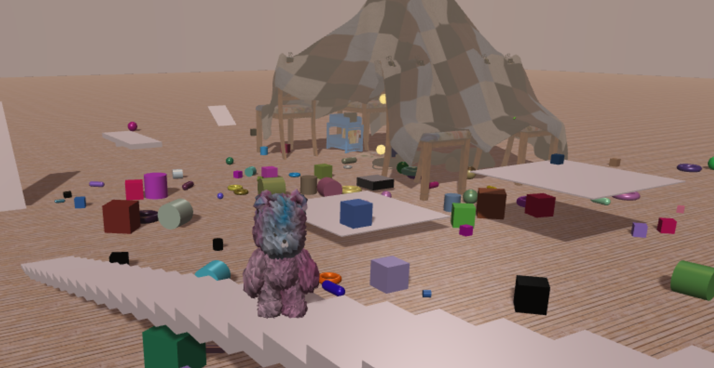
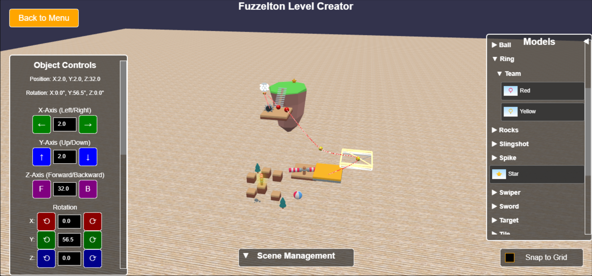
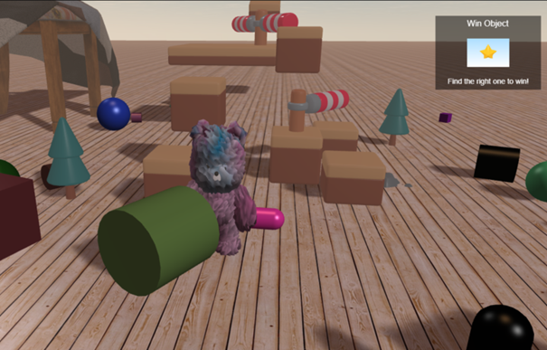

# ✨ Fuzzleton — The Dreamy Teddy Bear Adventure! ✨

*Play it. Build it. Share it. Become the teddy hero you were born to be.* 🧸🔥

## Created by

**Tristan Patout**
Master 1 student in IT/AI at **Université Côte d'Azur, France**

Developed as part of the *"3D Game Programming"* course, taught by **Michel Buffa**, and is designed to compete in the [**Games On Web 2025**](https://www.cgi.com/france/fr-fr/event/games-on-web-2025)
competition organized by **CGI** (on theme: *Dream Land*).

## Ready to Jump In?

Play **Fuzzleton** live right now on my VPS:
➡️ [https://fuzzleton.tristan-patout.fr](https://fuzzleton.tristan-patout.fr)

---

## 💫 Watch It In Action!

Curious how Fuzzleton looks? Check out this gameplay/demo video to see the teddy bear chaos and level editor magic come alive:
🎬 [Watch the Fuzzleton Gameplay Video](https://youtube)

---

## What’s Fuzzleton All About?

Imagine a wild, oversized kid’s bedroom — objects everywhere, chaos reigning supreme, and YOU control a fluffy teddy bear trying to navigate through this playful madness (every child's dream, right?).

Fuzzleton is a **physics-powered 3D platformer** developed in Babylon.js powered by the Havok physics engine. After setting up the physic based game environment and homemade physics character controller for our cuddly hero to take life, but also setting up lights, shadows and a lot more. Your mission? Jump, bounce, find the desired object, and conquer the wildest toy-land obstacles... all while dreaming up your own crazy levels!

**But wait... here’s the twist:**
Not only can you play the game, but you have to **build your own physics-based levels** — quickly and easily through our **level creator**— and share them with friends (or rivals !) to challenge their teddy bear skills.

---

## The Vision — Why Fuzzleton?
After setting up the basis of the project came fatidic questions: *What do I want to create?*, *How could I make levels integrating physics in a fun and easy way?*: Sure, Blender is fantastic for modeling but long, and exporting files, reconfiguring everything in the game quickly becomes a headache. I have tried Godot too, it is a solid engine too, but the same problems arose for integrating to my Babylon.js project.

So, what was the answer? You guessed it: build my very own level editor, fully integrated into the Babylon game itself! Allowing me to create levels rapidly from various objects models assets kits.
What was at start a simple idea for my to create levels fadter turned into the core concept of my project: The long-run dream is to create a Fuzzelton **community playground** where imagination knows no bounds.
* Navigate your teddy through chaotic kid’s rooms filled with oversized toys
* Overcome obstacles, bounce and find the hidden object
* Race other players to become the **King of the Room** — the teddy bear everyone dreams of!
* And **create your own levels** with a physics-driven level editor that puts the power of design in your hands!

🎫 Think of Fuzzleton as your ticket to a *dream land* where everyones adventure is unique - because *you* build it!

---

## Ressources & Inspirations

* Michel Buffa’s 3D Game Programming course wich was the foundation of this journey
* [Babylon.js](https://doc.babylonjs.com/) 
* [Babylon.js Forum](https://forum.babylonjs.com/) a lot of help from the community ! 
* [ergoudan by armomu](https://github.com/armomu/ergoudan) — inspiration for the character controller

---

## Thank you
I want to express my gratitude to CGI France, Michel Buffa, David Catuhe, Sébastien Vandenbergue, and Université Côte d'Azur for making this dream possible through the Games on Web 2025 competition. Offering the opportunity to learn more about 3D technologies and web development with Babylon.js, while stimulating our skills and creativity dreams ! 

---

## What’s Next?

The game is still early, level creator is awaiting for new implementations but you can already try and create levels. Ready to test, play, and build your own dreamland? Dive in and let the toy chaos begin!

---

## Illustrations 

---

Original Github of the project [here](https://github.com/3ST1/fuzzleton).
